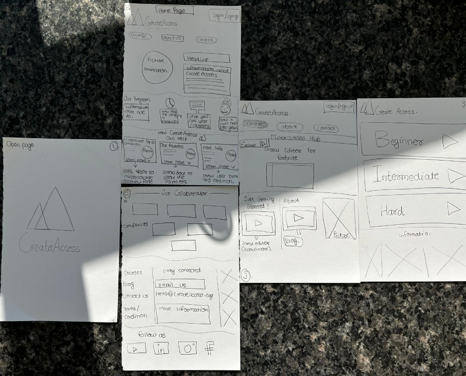

## Team Member
- Keta Patel
- Mahdi Almosawi
- Ning Gao
- Rafael Cruz Lagos
- Zhen Lu

## Project Proposal 
Problem Statement: Many Students and Individuals encounter challenges when entering high-impact fields like 3D creation due to limited access to beginner-friendly resources. These challenges are having fewer connections in the Tech world, not knowing where to start learning from, and uncertainty about leveraging these skills for career advancement.

From a user point of view as computer science students, we want to explore 3D creation in a way that is easy to understand and accessible to beginners like us. We need a resource that can build our confidence and help us see how these skills can be applied to real-world problems and future job opportunities.

User's Goal: 
- Learning the basics of 3D creation by working on practical problems.
- Developing confidence in applying 3D creation skills to projects.
- Understanding how it can help one build their career.

User's Action: 
- Practice using 3D tools on small projects to gain experience
- exploring the skills and learning for future opportunities.

User's Potential Obstacles: 
- It is difficult to know where to start because of the limited exposure to 3D creation tools

CreateAccess is committed to removing these barriers and helping users get started by offering free mini-courses. However, the existing website's user interface is not intuitive enough to quickly engage and guide users, especially first-time visitors. In addition, mobile access and accessibility features have not been fully optimized.

You can visit the website at [CreateAccess](https://createaccess.org/)

Prototype:
1. 

Briefing:

2.  "Welcome, and thank you for helping us test this prototype. This tool is designed as a learning platform for 3D creation, where users can explore various techniques and tools to create 3D models. Today, you’ll get a hands-on look at the main features we’re working on. We are working on the project for CreateAccess. Since this is a paper prototype, you can interact with it as if it were a real digital interface. You can ‘tap’ or ‘click’ on buttons, ‘scroll’ by pointing to different sections, and I’ll show you the screens as if you were navigating through the website.Please feel free to share your thoughts as you go along. Your feedback is incredibly valuable to us, and there are no wrong actions or answers—anything you find unclear helps us make the design better. Let’s get started!"

Scenario Tasks:

3. The scenario that we gave to our users was: 
Imagine you’re eager to start learning 3D creation. Begin by navigating to the course library to explore the available courses. Once there, select a course that interests you, open it to view more details, and proceed to start the first lesson or module. As you go through the course, interact with the content provided, including any tutorials, quizzes, or exercises within the initial module."

Observations:

4. During testing, several usability issues emerged. Users expressed confusion on the main page due to multiple buttons leading to the same course page, making navigation unclear and repetitive. Additionally, when attempting to access a course, users had to click through multiple screens, which felt cumbersome and led to frustration. This excess of steps to reach the course content highlighted a need for streamlining navigation and reducing redundant elements to create a smoother user experience.

Prototype Iteration:

5. Between the first and second rounds of prototyping, several adjustments were made based on user feedback. Initially, users found the main page confusing, as multiple buttons led to the same course library. To address this, we simplified the layout, reducing duplicate buttons and clarifying navigation paths. Additionally, accessing a course required multiple clicks, which users found cumbersome. In the second iteration, we streamlined the access flow, reducing the number of steps needed to reach course content by consolidating screens and minimizing extra navigation layers. These changes aimed to create a more intuitive and user-friendly experience.

Step 5: Interface Prototype

The interface we designed using Figma is viewable [here](https://www.figma.com/design/4ydKG380Srt5IpW33lY2Nn/Untitled?node-id=0-1&node-type=canvas&t=Qq94ocVSSfN7CgSS-0)

The first page that can be seen is the homepage. Right up top, the hyperlinks take you directly where you want to go on the site. The "course" button takes you to the second page, where the courses are shown, where the start learning button starts you with the beginner course and the download link sets you up with the proper tools. Then, you see a list of available courses in list format, which open the tutorials in a multiple part format that can be accessed through the bar up top which will correspond to which step of the tutorial you are on. The about button takes you to the about page where each major category of information of the site and company is shown, allowing you to learn more about each of them or continue to the contact form with any questions.

**Project Step 6 - Final Implementation**

Project Documentation: CreateAccess Website
1. Project Overview
The CreateAccess Website is an interactive platform designed to provide users with detailed information about 3D creation microcourses. It features dynamic navigation, embedded video content, and a visually appealing design to enhance the user experience.

The project is implemented using HTML, CSS, and JavaScript, and it includes functionality for switching between modules, embedded YouTube videos, and navigation between pages.

A link to your implementation (code)

**Instructions to Run the Website Locally**

Step 1: Download the Code
Visit the link to download the code repository

Step 2: Open the Files in a Browser
Locate the project folder on your computer.
Inside the folder, find the main HTML file:
Example: index.html.
Double-click the index.html file, or right-click it and choose Open with > Your Browser.

Step 3: Navigate the Website
Once the website is open in your browser:
Use the navigation bar at the top to explore different sections, such as "Home," "Courses," "About Us," and "Contact."
Click on buttons or links to interact with the dynamic features, such as course modules or forms.

  

